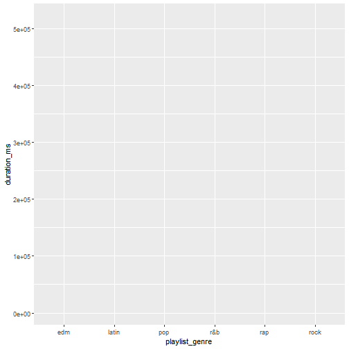
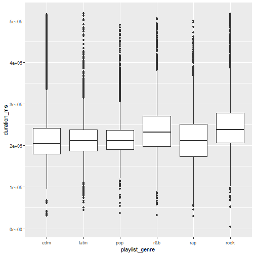
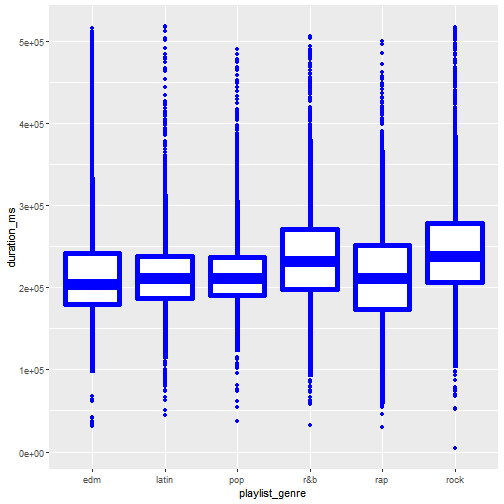
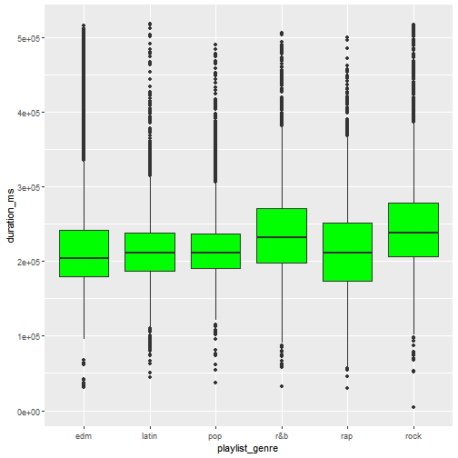
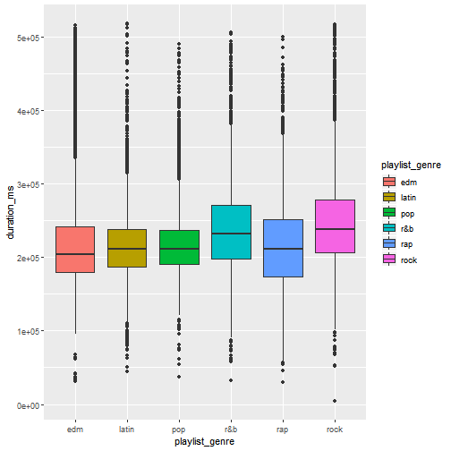
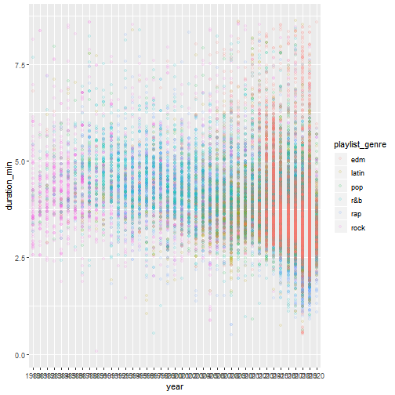
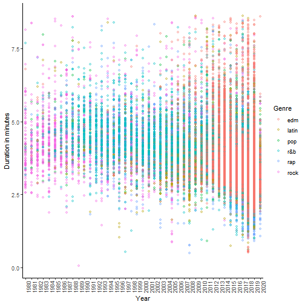

```r
# StatML Workshop
# Introduction to Data Wrangling and Visualisation in R with the Tidyverse
# Oxford IT Services


#### 0. Getting Started ####

# Load tidyverse package
library(tidyverse)  # May require installation first
```

```
## -- Attaching packages --------------------------------------- tidyverse 1.2.1 --
```

```
## v ggplot2 3.2.1     v purrr   0.3.3
## v tibble  2.1.3     v dplyr   0.8.3
## v tidyr   1.0.0     v stringr 1.4.0
## v readr   1.3.1     v forcats 0.4.0
```

```
## Warning: package 'tidyr' was built under R version 3.6.2
```

```
## -- Conflicts ------------------------------------------ tidyverse_conflicts() --
## x dplyr::filter() masks stats::filter()
## x dplyr::lag()    masks stats::lag()
```

```r
# Download data file into project
download.file(url = "https://raw.githubusercontent.com/rfordatascience/tidytuesday/master/data/2020/2020-01-21/spotify_songs.csv",
              destfile = "spotify-data.csv")

# Load datafile into R session
spotify <- read_csv("spotify-data.csv")
```

```
## Parsed with column specification:
## cols(
##   .default = col_double(),
##   track_id = col_character(),
##   track_name = col_character(),
##   track_artist = col_character(),
##   track_album_id = col_character(),
##   track_album_name = col_character(),
##   track_album_release_date = col_character(),
##   playlist_name = col_character(),
##   playlist_id = col_character(),
##   playlist_genre = col_character(),
##   playlist_subgenre = col_character()
## )
```

```
## See spec(...) for full column specifications.
```

```r
# Inspect data
spotify         # The data object has 32,833 observations (rows) and 23 fields (columns)
```

```
## # A tibble: 32,833 x 23
##    track_id track_name track_artist track_popularity track_album_id
##    <chr>    <chr>      <chr>                   <dbl> <chr>         
##  1 6f807x0~ I Don't C~ Ed Sheeran                 66 2oCs0DGTsRO98~
##  2 0r7CVbZ~ Memories ~ Maroon 5                   67 63rPSO264uRjW~
##  3 1z1Hg7V~ All the T~ Zara Larsson               70 1HoSmj2eLcsrR~
##  4 75Fpbth~ Call You ~ The Chainsm~               60 1nqYsOef1yKKu~
##  5 1e8PAfc~ Someone Y~ Lewis Capal~               69 7m7vv9wlQ4i0L~
##  6 7fvUMiy~ Beautiful~ Ed Sheeran                 67 2yiy9cd2QktrN~
##  7 2OAylPU~ Never Rea~ Katy Perry                 62 7INHYSeusaFly~
##  8 6b1RNvA~ Post Malo~ Sam Feldt                  69 6703SRPsLkS4b~
##  9 7bF6tCO~ Tough Lov~ Avicii                     68 7CvAfGvq4RlIw~
## 10 1IXGILk~ If I Can'~ Shawn Mendes               67 4QxzbfSsVryEQ~
## # ... with 32,823 more rows, and 18 more variables:
## #   track_album_name <chr>, track_album_release_date <chr>,
## #   playlist_name <chr>, playlist_id <chr>, playlist_genre <chr>,
## #   playlist_subgenre <chr>, danceability <dbl>, energy <dbl>, key <dbl>,
## #   loudness <dbl>, mode <dbl>, speechiness <dbl>, acousticness <dbl>,
## #   instrumentalness <dbl>, liveness <dbl>, valence <dbl>, tempo <dbl>,
## #   duration_ms <dbl>
```

```r
class(spotify)  # The object is a tidy dataframe called a "tibble"
```

```
## [1] "spec_tbl_df" "tbl_df"      "tbl"         "data.frame"
```

```r
names(spotify)  # Names for the columns
```

```
##  [1] "track_id"                 "track_name"              
##  [3] "track_artist"             "track_popularity"        
##  [5] "track_album_id"           "track_album_name"        
##  [7] "track_album_release_date" "playlist_name"           
##  [9] "playlist_id"              "playlist_genre"          
## [11] "playlist_subgenre"        "danceability"            
## [13] "energy"                   "key"                     
## [15] "loudness"                 "mode"                    
## [17] "speechiness"              "acousticness"            
## [19] "instrumentalness"         "liveness"                
## [21] "valence"                  "tempo"                   
## [23] "duration_ms"
```

```r
#### 1. DATA WRANGLING ####
```

The primary data manipulation package in tidyverse is called `dplyr`
(shortname for "data frame" and "pliers", like the tool). 

The functions in this package are used the write efficient code that is also
more readable to humans than base R code. Sometimes `dplyr` functions are called
"verbs", which can be a helpful way of envision the "wrangling" steps.

The first argument in each `dplyr` function is *always* the dataframe. Soon 
we'll see how to use this structure to string multiple steps together into a 
single manipulation pipeline.


```r
# 1.1 Selecting columns, filtering rows ----
```

Use the select() function to select specific columns in the dataframe. Start 
with the dataframe object, than the desired, column(s). 


```r
select(spotify, track_name)
```

```
## # A tibble: 32,833 x 1
##    track_name                                           
##    <chr>                                                
##  1 I Don't Care (with Justin Bieber) - Loud Luxury Remix
##  2 Memories - Dillon Francis Remix                      
##  3 All the Time - Don Diablo Remix                      
##  4 Call You Mine - Keanu Silva Remix                    
##  5 Someone You Loved - Future Humans Remix              
##  6 Beautiful People (feat. Khalid) - Jack Wins Remix    
##  7 Never Really Over - R3HAB Remix                      
##  8 Post Malone (feat. RANI) - GATTÜSO Remix             
##  9 Tough Love - Tiësto Remix / Radio Edit               
## 10 If I Can't Have You - Gryffin Remix                  
## # ... with 32,823 more rows
```

```r
select(spotify, track_name, track_artist, playlist_genre)
```

```
## # A tibble: 32,833 x 3
##    track_name                                 track_artist   playlist_genre
##    <chr>                                      <chr>          <chr>         
##  1 I Don't Care (with Justin Bieber) - Loud ~ Ed Sheeran     pop           
##  2 Memories - Dillon Francis Remix            Maroon 5       pop           
##  3 All the Time - Don Diablo Remix            Zara Larsson   pop           
##  4 Call You Mine - Keanu Silva Remix          The Chainsmok~ pop           
##  5 Someone You Loved - Future Humans Remix    Lewis Capaldi  pop           
##  6 Beautiful People (feat. Khalid) - Jack Wi~ Ed Sheeran     pop           
##  7 Never Really Over - R3HAB Remix            Katy Perry     pop           
##  8 Post Malone (feat. RANI) - GATTÜSO Remix   Sam Feldt      pop           
##  9 Tough Love - Tiësto Remix / Radio Edit     Avicii         pop           
## 10 If I Can't Have You - Gryffin Remix        Shawn Mendes   pop           
## # ... with 32,823 more rows
```

```r
# dplyr can use quoted or unquoted names:
select(spotify, track_name, "track_album_name")
```

```
## # A tibble: 32,833 x 2
##    track_name                          track_album_name                    
##    <chr>                               <chr>                               
##  1 I Don't Care (with Justin Bieber) ~ I Don't Care (with Justin Bieber) [~
##  2 Memories - Dillon Francis Remix     Memories (Dillon Francis Remix)     
##  3 All the Time - Don Diablo Remix     All the Time (Don Diablo Remix)     
##  4 Call You Mine - Keanu Silva Remix   Call You Mine - The Remixes         
##  5 Someone You Loved - Future Humans ~ Someone You Loved (Future Humans Re~
##  6 Beautiful People (feat. Khalid) - ~ Beautiful People (feat. Khalid) [Ja~
##  7 Never Really Over - R3HAB Remix     Never Really Over (R3HAB Remix)     
##  8 Post Malone (feat. RANI) - GATTÜSO~ Post Malone (feat. RANI) [GATTÜSO R~
##  9 Tough Love - Tiësto Remix / Radio ~ Tough Love (Tiësto Remix)           
## 10 If I Can't Have You - Gryffin Remix If I Can't Have You (Gryffin Remix) 
## # ... with 32,823 more rows
```

```r
# You can also use the numeric index to select, however using the column name 
# will make your code more reproducible:
select(spotify, 2, 10)
```

```
## # A tibble: 32,833 x 2
##    track_name                                            playlist_genre
##    <chr>                                                 <chr>         
##  1 I Don't Care (with Justin Bieber) - Loud Luxury Remix pop           
##  2 Memories - Dillon Francis Remix                       pop           
##  3 All the Time - Don Diablo Remix                       pop           
##  4 Call You Mine - Keanu Silva Remix                     pop           
##  5 Someone You Loved - Future Humans Remix               pop           
##  6 Beautiful People (feat. Khalid) - Jack Wins Remix     pop           
##  7 Never Really Over - R3HAB Remix                       pop           
##  8 Post Malone (feat. RANI) - GATTÜSO Remix              pop           
##  9 Tough Love - Tiësto Remix / Radio Edit                pop           
## 10 If I Can't Have You - Gryffin Remix                   pop           
## # ... with 32,823 more rows
```

```r
# We can also change the name of columns within select()

select(spotify, song = track_name, artist = track_artist)
```

```
## # A tibble: 32,833 x 2
##    song                                                  artist          
##    <chr>                                                 <chr>           
##  1 I Don't Care (with Justin Bieber) - Loud Luxury Remix Ed Sheeran      
##  2 Memories - Dillon Francis Remix                       Maroon 5        
##  3 All the Time - Don Diablo Remix                       Zara Larsson    
##  4 Call You Mine - Keanu Silva Remix                     The Chainsmokers
##  5 Someone You Loved - Future Humans Remix               Lewis Capaldi   
##  6 Beautiful People (feat. Khalid) - Jack Wins Remix     Ed Sheeran      
##  7 Never Really Over - R3HAB Remix                       Katy Perry      
##  8 Post Malone (feat. RANI) - GATTÜSO Remix              Sam Feldt       
##  9 Tough Love - Tiësto Remix / Radio Edit                Avicii          
## 10 If I Can't Have You - Gryffin Remix                   Shawn Mendes    
## # ... with 32,823 more rows
```

Use the filter() to select rows based on specific criteria. Remember to start 
with the object, then the selection criteria with base R notation:


```r
filter(spotify, track_popularity  > 90)
```

```
## # A tibble: 252 x 23
##    track_id track_name track_artist track_popularity track_album_id
##    <chr>    <chr>      <chr>                   <dbl> <chr>         
##  1 6cy3ki6~ RITMO (Ba~ The Black E~               96 6EobpC5SDFy5D~
##  2 7CHi4Dt~ Lose Cont~ MEDUZA                     91 1qSOaTvsCOyFJ~
##  3 2Fxmhks~ bad guy    Billie Eili~               95 0S0KGZnfBGSIs~
##  4 2tnVG71~ Ride It    Regard                     94 4zOhjJfe0dwqs~
##  5 7k4t7uL~ Tusa       KAROL G                    98 7mKevNHhVnZER~
##  6 3ZCTVFB~ everythin~ Billie Eili~               97 4i3rAwPw7Ln2Y~
##  7 41L3O37~ Yummy      Justin Bieb~               95 1SN6N3fNkZk5o~
##  8 2ksOAxt~ China      Anuel AA                   93 1PTTAq0OxggVg~
##  9 0TK2YIl~ Señorita   Shawn Mendes               93 2ZaX1FdZCwchX~
## 10 2b8fOow~ Memories   Maroon 5                   98 3nR9B40hYLKLc~
## # ... with 242 more rows, and 18 more variables: track_album_name <chr>,
## #   track_album_release_date <chr>, playlist_name <chr>,
## #   playlist_id <chr>, playlist_genre <chr>, playlist_subgenre <chr>,
## #   danceability <dbl>, energy <dbl>, key <dbl>, loudness <dbl>,
## #   mode <dbl>, speechiness <dbl>, acousticness <dbl>,
## #   instrumentalness <dbl>, liveness <dbl>, valence <dbl>, tempo <dbl>,
## #   duration_ms <dbl>
```

```r
filter(spotify, track_artist == "Ed Sheeran")
```

```
## # A tibble: 69 x 23
##    track_id track_name track_artist track_popularity track_album_id
##    <chr>    <chr>      <chr>                   <dbl> <chr>         
##  1 6f807x0~ I Don't C~ Ed Sheeran                 66 2oCs0DGTsRO98~
##  2 7fvUMiy~ Beautiful~ Ed Sheeran                 67 2yiy9cd2QktrN~
##  3 3eFJI47~ Cross Me ~ Ed Sheeran                 58 49bXZtlI5kQSq~
##  4 1EJgymg~ South of ~ Ed Sheeran                 66 1imXAvLuowvPY~
##  5 3vQhEd4~ South of ~ Ed Sheeran                 65 05Bru0ZVTxp4o~
##  6 19TOAlT~ South of ~ Ed Sheeran                 69 3BjxjIkTZKUpe~
##  7 1uuUnsW~ Happier -~ Ed Sheeran                 53 5GpwroXObdnET~
##  8 7qiZfU4~ Shape of ~ Ed Sheeran                 86 3T4tUhGYeRNVU~
##  9 70eFcWO~ Beautiful~ Ed Sheeran                 85 3oIFxDIo2fwuk~
## 10 4vUmTMu~ South of ~ Ed Sheeran                 91 3oIFxDIo2fwuk~
## # ... with 59 more rows, and 18 more variables: track_album_name <chr>,
## #   track_album_release_date <chr>, playlist_name <chr>,
## #   playlist_id <chr>, playlist_genre <chr>, playlist_subgenre <chr>,
## #   danceability <dbl>, energy <dbl>, key <dbl>, loudness <dbl>,
## #   mode <dbl>, speechiness <dbl>, acousticness <dbl>,
## #   instrumentalness <dbl>, liveness <dbl>, valence <dbl>, tempo <dbl>,
## #   duration_ms <dbl>
```

Filters can be based on multiple conditions, across columns. They can include 
the "and" (&), "or" (|), and matching operators (%in%):


```r
filter(spotify, track_artist == "Avicii" & track_album_name == "Stories")
```

```
## # A tibble: 8 x 23
##   track_id track_name track_artist track_popularity track_album_id
##   <chr>    <chr>      <chr>                   <dbl> <chr>         
## 1 6nsLzJf~ Waiting F~ Avicii                     16 5ttIIMPWCp2bv~
## 2 2BVVmJQ~ Broken Ar~ Avicii                     10 5ttIIMPWCp2bv~
## 3 6nsLzJf~ Waiting F~ Avicii                     16 5ttIIMPWCp2bv~
## 4 2P4OICZ~ Waiting F~ Avicii                     78 7dqftJ3kas6D0~
## 5 7kbTZWt~ For A Bet~ Avicii                     66 7dqftJ3kas6D0~
## 6 5IZg7Ng~ Talk To M~ Avicii                     53 7dqftJ3kas6D0~
## 7 2P4OICZ~ Waiting F~ Avicii                     78 7dqftJ3kas6D0~
## 8 7br84ZQ~ Gonna Lov~ Avicii                      8 5ttIIMPWCp2bv~
## # ... with 18 more variables: track_album_name <chr>,
## #   track_album_release_date <chr>, playlist_name <chr>,
## #   playlist_id <chr>, playlist_genre <chr>, playlist_subgenre <chr>,
## #   danceability <dbl>, energy <dbl>, key <dbl>, loudness <dbl>,
## #   mode <dbl>, speechiness <dbl>, acousticness <dbl>,
## #   instrumentalness <dbl>, liveness <dbl>, valence <dbl>, tempo <dbl>,
## #   duration_ms <dbl>
```

```r
filter(spotify, playlist_genre == "pop" | playlist_genre == "r&b")
```

```
## # A tibble: 10,938 x 23
##    track_id track_name track_artist track_popularity track_album_id
##    <chr>    <chr>      <chr>                   <dbl> <chr>         
##  1 6f807x0~ I Don't C~ Ed Sheeran                 66 2oCs0DGTsRO98~
##  2 0r7CVbZ~ Memories ~ Maroon 5                   67 63rPSO264uRjW~
##  3 1z1Hg7V~ All the T~ Zara Larsson               70 1HoSmj2eLcsrR~
##  4 75Fpbth~ Call You ~ The Chainsm~               60 1nqYsOef1yKKu~
##  5 1e8PAfc~ Someone Y~ Lewis Capal~               69 7m7vv9wlQ4i0L~
##  6 7fvUMiy~ Beautiful~ Ed Sheeran                 67 2yiy9cd2QktrN~
##  7 2OAylPU~ Never Rea~ Katy Perry                 62 7INHYSeusaFly~
##  8 6b1RNvA~ Post Malo~ Sam Feldt                  69 6703SRPsLkS4b~
##  9 7bF6tCO~ Tough Lov~ Avicii                     68 7CvAfGvq4RlIw~
## 10 1IXGILk~ If I Can'~ Shawn Mendes               67 4QxzbfSsVryEQ~
## # ... with 10,928 more rows, and 18 more variables:
## #   track_album_name <chr>, track_album_release_date <chr>,
## #   playlist_name <chr>, playlist_id <chr>, playlist_genre <chr>,
## #   playlist_subgenre <chr>, danceability <dbl>, energy <dbl>, key <dbl>,
## #   loudness <dbl>, mode <dbl>, speechiness <dbl>, acousticness <dbl>,
## #   instrumentalness <dbl>, liveness <dbl>, valence <dbl>, tempo <dbl>,
## #   duration_ms <dbl>
```

```r
filter(spotify, track_artist %in% c("Billie Eilish", "Sam Smith", "Lady Gaga"))
```

```
## # A tibble: 93 x 23
##    track_id track_name track_artist track_popularity track_album_id
##    <chr>    <chr>      <chr>                   <dbl> <chr>         
##  1 0GfS3y8~ Dancing W~ Sam Smith                  69 2LDzwN4iZ4qbS~
##  2 3yNZ5r3~ bad guy (~ Billie Eili~               83 6lMlX68jJrx67~
##  3 0WfKDYe~ Poker Face Lady Gaga                  69 2FBA8NCSuQNi8~
##  4 2Fxmhks~ bad guy    Billie Eili~               95 0S0KGZnfBGSIs~
##  5 6Qs4SXO~ Dancing W~ Sam Smith                  87 1V9oE8bVilClr~
##  6 3ZCTVFB~ everythin~ Billie Eili~               97 4i3rAwPw7Ln2Y~
##  7 29MOOOm~ I Feel Lo~ Sam Smith                  78 2DmVNmERvg6j9~
##  8 6b2RcmU~ How Do Yo~ Sam Smith                  91 7baaCf70tVcUB~
##  9 2Fxmhks~ bad guy    Billie Eili~               95 0S0KGZnfBGSIs~
## 10 3ZCTVFB~ everythin~ Billie Eili~               97 4i3rAwPw7Ln2Y~
## # ... with 83 more rows, and 18 more variables: track_album_name <chr>,
## #   track_album_release_date <chr>, playlist_name <chr>,
## #   playlist_id <chr>, playlist_genre <chr>, playlist_subgenre <chr>,
## #   danceability <dbl>, energy <dbl>, key <dbl>, loudness <dbl>,
## #   mode <dbl>, speechiness <dbl>, acousticness <dbl>,
## #   instrumentalness <dbl>, liveness <dbl>, valence <dbl>, tempo <dbl>,
## #   duration_ms <dbl>
```

```r
# 1.2 Piping steps together ----
```

Often data wrangling involves multiple steps. The Tidyverse includes a special 
operator called a "pipe", which is written as %>%. 
The pipe works by sending output of one function into the first augment of 
the next function. Since the first argument in dyplr functions is always the 
dataframe object we can use pipes to string together wrangling steps. 
For example, here is how to show just the most popular songs and their 
artists:


```r
select(spotify, track_name, track_artist, track_popularity) %>% 
  filter(track_popularity > 95)
```

```
## # A tibble: 71 x 3
##    track_name                track_artist        track_popularity
##    <chr>                     <chr>                          <dbl>
##  1 RITMO (Bad Boys For Life) The Black Eyed Peas               96
##  2 Tusa                      KAROL G                           98
##  3 everything i wanted       Billie Eilish                     97
##  4 Memories                  Maroon 5                          98
##  5 Blinding Lights           The Weeknd                        98
##  6 Memories                  Maroon 5                          98
##  7 Circles                   Post Malone                       98
##  8 Don't Start Now           Dua Lipa                          97
##  9 RITMO (Bad Boys For Life) The Black Eyed Peas               96
## 10 everything i wanted       Billie Eilish                     97
## # ... with 61 more rows
```

Note that in the filter() step we did not putting in the put the 'spotify' 
object in, it was provided by the pipe. Another way to do this would be to 
start by piping the data frame object:


```r
spotify %>% 
  select(track_name, track_artist, track_popularity) %>% 
  filter(track_popularity > 95)
```

```
## # A tibble: 71 x 3
##    track_name                track_artist        track_popularity
##    <chr>                     <chr>                          <dbl>
##  1 RITMO (Bad Boys For Life) The Black Eyed Peas               96
##  2 Tusa                      KAROL G                           98
##  3 everything i wanted       Billie Eilish                     97
##  4 Memories                  Maroon 5                          98
##  5 Blinding Lights           The Weeknd                        98
##  6 Memories                  Maroon 5                          98
##  7 Circles                   Post Malone                       98
##  8 Don't Start Now           Dua Lipa                          97
##  9 RITMO (Bad Boys For Life) The Black Eyed Peas               96
## 10 everything i wanted       Billie Eilish                     97
## # ... with 61 more rows
```

This creates a human-readable script that shows the wrangling steps with 
dplyr's "verb" functions. 


```r
# 1.3 Mutate new columns ----
```

The mutate() function is used to create new columns. For example, we can 
create a new column for the song duration in seconds:


```r
spotify %>% 
  select(track_name, duration_ms) %>% 
  mutate(duration_s = duration_ms / 1000)
```

```
## # A tibble: 32,833 x 3
##    track_name                                        duration_ms duration_s
##    <chr>                                                   <dbl>      <dbl>
##  1 I Don't Care (with Justin Bieber) - Loud Luxury ~      194754       195.
##  2 Memories - Dillon Francis Remix                        162600       163.
##  3 All the Time - Don Diablo Remix                        176616       177.
##  4 Call You Mine - Keanu Silva Remix                      169093       169.
##  5 Someone You Loved - Future Humans Remix                189052       189.
##  6 Beautiful People (feat. Khalid) - Jack Wins Remix      163049       163.
##  7 Never Really Over - R3HAB Remix                        187675       188.
##  8 Post Malone (feat. RANI) - GATTÜSO Remix               207619       208.
##  9 Tough Love - Tiësto Remix / Radio Edit                 193187       193.
## 10 If I Can't Have You - Gryffin Remix                    253040       253.
## # ... with 32,823 more rows
```

We can use the new column to make additional columns, but order matters.
This does not work:


```r
spotify %>%
  select(track_name, duration_ms) %>%
  mutate(duration_min = duration_s / 60,
         duration_s = duration_ms / 1000)
```

```
## Error: object 'duration_s' not found
```

```r
# But this does:
spotify %>% 
  select(track_name, duration_ms) %>% 
  mutate(duration_s = duration_ms / 1000,
         duration_min = duration_s / 60)
```

```
## # A tibble: 32,833 x 4
##    track_name                           duration_ms duration_s duration_min
##    <chr>                                      <dbl>      <dbl>        <dbl>
##  1 I Don't Care (with Justin Bieber) -~      194754       195.         3.25
##  2 Memories - Dillon Francis Remix           162600       163.         2.71
##  3 All the Time - Don Diablo Remix           176616       177.         2.94
##  4 Call You Mine - Keanu Silva Remix         169093       169.         2.82
##  5 Someone You Loved - Future Humans R~      189052       189.         3.15
##  6 Beautiful People (feat. Khalid) - J~      163049       163.         2.72
##  7 Never Really Over - R3HAB Remix           187675       188.         3.13
##  8 Post Malone (feat. RANI) - GATTÜSO ~      207619       208.         3.46
##  9 Tough Love - Tiësto Remix / Radio E~      193187       193.         3.22
## 10 If I Can't Have You - Gryffin Remix       253040       253.         4.22
## # ... with 32,823 more rows
```

The same is true for all functions in the pipe, if we remove a column with 
select, we can't then use it in a mutate:


```r
spotify %>% 
  select(track_name) %>% 
  mutate(duration_s = duration_ms / 1000)
```

```
## Error: object 'duration_ms' not found
```

```r
# If we don't want the old column we need another select():
spotify %>% 
  select(track_name, duration_ms) %>% 
  mutate(duration_s = duration_ms / 1000) %>% 
  select(-duration_ms)  
```

```
## # A tibble: 32,833 x 2
##    track_name                                            duration_s
##    <chr>                                                      <dbl>
##  1 I Don't Care (with Justin Bieber) - Loud Luxury Remix       195.
##  2 Memories - Dillon Francis Remix                             163.
##  3 All the Time - Don Diablo Remix                             177.
##  4 Call You Mine - Keanu Silva Remix                           169.
##  5 Someone You Loved - Future Humans Remix                     189.
##  6 Beautiful People (feat. Khalid) - Jack Wins Remix           163.
##  7 Never Really Over - R3HAB Remix                             188.
##  8 Post Malone (feat. RANI) - GATTÜSO Remix                    208.
##  9 Tough Love - Tiësto Remix / Radio Edit                      193.
## 10 If I Can't Have You - Gryffin Remix                         253.
## # ... with 32,823 more rows
```

```r
# 1.4 Separating and uniting columns ----
```

The separate() function can be used to split one column into multiple based 
on a particular character


```r
spotify %>% 
  select(track_name, track_album_release_date) %>% 
  separate(col = track_album_release_date, 
           into = c("year", "month", "day"), 
           sep = "-")
```

```
## Warning: Expected 3 pieces. Missing pieces filled with `NA` in 1886 rows
## [152, 750, 751, 752, 754, 756, 760, 766, 769, 780, 783, 786, 787, 788, 789,
## 790, 794, 799, 805, 806, ...].
```

```
## # A tibble: 32,833 x 4
##    track_name                                            year  month day  
##    <chr>                                                 <chr> <chr> <chr>
##  1 I Don't Care (with Justin Bieber) - Loud Luxury Remix 2019  06    14   
##  2 Memories - Dillon Francis Remix                       2019  12    13   
##  3 All the Time - Don Diablo Remix                       2019  07    05   
##  4 Call You Mine - Keanu Silva Remix                     2019  07    19   
##  5 Someone You Loved - Future Humans Remix               2019  03    05   
##  6 Beautiful People (feat. Khalid) - Jack Wins Remix     2019  07    11   
##  7 Never Really Over - R3HAB Remix                       2019  07    26   
##  8 Post Malone (feat. RANI) - GATTÜSO Remix              2019  08    29   
##  9 Tough Love - Tiësto Remix / Radio Edit                2019  06    14   
## 10 If I Can't Have You - Gryffin Remix                   2019  06    20   
## # ... with 32,823 more rows
```

The opposite of separate() is unite(), which can combine multiple columns 
into a single column:


```r
spotify %>% 
  select(track_name, playlist_genre, playlist_subgenre) %>% 
  unite(col = "full_genre", playlist_genre, playlist_subgenre, 
        sep = " - ")
```

```
## # A tibble: 32,833 x 2
##    track_name                                            full_genre     
##    <chr>                                                 <chr>          
##  1 I Don't Care (with Justin Bieber) - Loud Luxury Remix pop - dance pop
##  2 Memories - Dillon Francis Remix                       pop - dance pop
##  3 All the Time - Don Diablo Remix                       pop - dance pop
##  4 Call You Mine - Keanu Silva Remix                     pop - dance pop
##  5 Someone You Loved - Future Humans Remix               pop - dance pop
##  6 Beautiful People (feat. Khalid) - Jack Wins Remix     pop - dance pop
##  7 Never Really Over - R3HAB Remix                       pop - dance pop
##  8 Post Malone (feat. RANI) - GATTÜSO Remix              pop - dance pop
##  9 Tough Love - Tiësto Remix / Radio Edit                pop - dance pop
## 10 If I Can't Have You - Gryffin Remix                   pop - dance pop
## # ... with 32,823 more rows
```

Note that these functions actually come from the `tidyr` package, which is 
also include in library(tidyverse).


```r
# 1.5 Grouping and summarising ----

# Use the distinct() function to show each of the unique values in a column:

spotify %>% 
  distinct(playlist_subgenre)
```

```
## # A tibble: 24 x 1
##    playlist_subgenre
##    <chr>            
##  1 dance pop        
##  2 post-teen pop    
##  3 electropop       
##  4 indie poptimism  
##  5 hip hop          
##  6 southern hip hop 
##  7 gangster rap     
##  8 trap             
##  9 album rock       
## 10 classic rock     
## # ... with 14 more rows
```

```r
# By default tibbles will only print the first 10 entries, but we can adjust 
# the number of rows using the print() function

spotify %>% 
  distinct(playlist_subgenre) %>% 
  print(n = Inf)
```

```
## # A tibble: 24 x 1
##    playlist_subgenre        
##    <chr>                    
##  1 dance pop                
##  2 post-teen pop            
##  3 electropop               
##  4 indie poptimism          
##  5 hip hop                  
##  6 southern hip hop         
##  7 gangster rap             
##  8 trap                     
##  9 album rock               
## 10 classic rock             
## 11 permanent wave           
## 12 hard rock                
## 13 tropical                 
## 14 latin pop                
## 15 reggaeton                
## 16 latin hip hop            
## 17 urban contemporary       
## 18 hip pop                  
## 19 new jack swing           
## 20 neo soul                 
## 21 electro house            
## 22 big room                 
## 23 pop edm                  
## 24 progressive electro house
```

Sometimes you may want to aggregate data based on the different groups or 
types. First use the group_by() to organize the data based on the number of 
distinct values: 


```r
spotify %>% 
  group_by(playlist_subgenre)
```

```
## # A tibble: 32,833 x 23
## # Groups:   playlist_subgenre [24]
##    track_id track_name track_artist track_popularity track_album_id
##    <chr>    <chr>      <chr>                   <dbl> <chr>         
##  1 6f807x0~ I Don't C~ Ed Sheeran                 66 2oCs0DGTsRO98~
##  2 0r7CVbZ~ Memories ~ Maroon 5                   67 63rPSO264uRjW~
##  3 1z1Hg7V~ All the T~ Zara Larsson               70 1HoSmj2eLcsrR~
##  4 75Fpbth~ Call You ~ The Chainsm~               60 1nqYsOef1yKKu~
##  5 1e8PAfc~ Someone Y~ Lewis Capal~               69 7m7vv9wlQ4i0L~
##  6 7fvUMiy~ Beautiful~ Ed Sheeran                 67 2yiy9cd2QktrN~
##  7 2OAylPU~ Never Rea~ Katy Perry                 62 7INHYSeusaFly~
##  8 6b1RNvA~ Post Malo~ Sam Feldt                  69 6703SRPsLkS4b~
##  9 7bF6tCO~ Tough Lov~ Avicii                     68 7CvAfGvq4RlIw~
## 10 1IXGILk~ If I Can'~ Shawn Mendes               67 4QxzbfSsVryEQ~
## # ... with 32,823 more rows, and 18 more variables:
## #   track_album_name <chr>, track_album_release_date <chr>,
## #   playlist_name <chr>, playlist_id <chr>, playlist_genre <chr>,
## #   playlist_subgenre <chr>, danceability <dbl>, energy <dbl>, key <dbl>,
## #   loudness <dbl>, mode <dbl>, speechiness <dbl>, acousticness <dbl>,
## #   instrumentalness <dbl>, liveness <dbl>, valence <dbl>, tempo <dbl>,
## #   duration_ms <dbl>
```

Notice that the table did not change, however the print out now starts that 
there are groups, based on the playlist_subgenre column, and how many. We can 
use the count() function to tally the number of observations in each group.


```r
spotify %>% 
  group_by(playlist_subgenre) %>% 
  count()
```

```
## # A tibble: 24 x 2
## # Groups:   playlist_subgenre [24]
##    playlist_subgenre     n
##    <chr>             <int>
##  1 album rock         1065
##  2 big room           1206
##  3 classic rock       1296
##  4 dance pop          1298
##  5 electro house      1511
##  6 electropop         1408
##  7 gangster rap       1458
##  8 hard rock          1485
##  9 hip hop            1322
## 10 hip pop            1256
## # ... with 14 more rows
```

Often we want to do more complex aggregations, for that we can use the 
summarise() (or summarize() for my fellow Americans!):


```r
spotify %>% 
  group_by(genre = playlist_subgenre) %>% 
  summarise(n_tracks       = n(), 
            avg_popularity = mean(track_popularity), 
            top_popularity = max(track_popularity))
```

```
## # A tibble: 24 x 4
##    genre         n_tracks avg_popularity top_popularity
##    <chr>            <int>          <dbl>          <dbl>
##  1 album rock        1065           38.3             85
##  2 big room          1206           32.3             94
##  3 classic rock      1296           40.8             83
##  4 dance pop         1298           52.1             98
##  5 electro house     1511           35.5             91
##  6 electropop        1408           42.7             97
##  7 gangster rap      1458           35.1             98
##  8 hard rock         1485           35.8             83
##  9 hip hop           1322           53.8             98
## 10 hip pop           1256           53.8             99
## # ... with 14 more rows
```

meidut a time. Also, use the arrange() function 
to order the table based on one or more columns. By default this will sort 
the table in ascending order, wrap the column name with desc() for descending 
order.


```r
spotify %>% 
  filter(track_artist == "Drake") %>% 
  group_by(album = track_album_name, genre = playlist_genre) %>% 
  summarise(n_tracks       = n(),
            avg_popularity = mean(track_popularity), 
            top_popularity = max(track_popularity)) %>% 
  arrange(album, desc(n_tracks)) %>% 
  print(n = Inf)
```

```
## # A tibble: 47 x 5
## # Groups:   album [27]
##    album                       genre n_tracks avg_popularity top_popularity
##    <chr>                       <chr>    <int>          <dbl>          <dbl>
##  1 0 To 100 / The Catch Up     r&b          1            5                5
##  2 Back To Back                rap          2           69               69
##  3 Behind Barz (Bonus)         rap          1           74               74
##  4 Care Package                r&b          3           61.3             66
##  5 Fake Love                   latin        1            6                6
##  6 Forever                     edm          1            2                2
##  7 Forever                     rap          1            2                2
##  8 Hold On, We're Going Home   rap          1            1                1
##  9 Hotline Bling               pop          2            9.5             10
## 10 Hotline Bling               latin        1           10               10
## 11 If You're Reading This It'~ r&b          4           18               70
## 12 More Life                   rap          6           45.3             74
## 13 More Life                   r&b          2           72               75
## 14 More Life                   pop          1           15               15
## 15 More Than A Game            rap          1           67               67
## 16 Nice For What               rap          1           18               18
## 17 Nothing Was The Same (Delu~ r&b          1           53               53
## 18 One Dance                   pop          1           12               12
## 19 One Dance                   r&b          1           12               12
## 20 Scary Hours                 r&b          1           17               17
## 21 Scary Hours                 rap          1           17               17
## 22 Scorpion                    r&b          9           40.4             86
## 23 Scorpion                    rap          3           12.7             13
## 24 Scorpion                    pop          2           84.5             86
## 25 Scorpion                    edm          1           86               86
## 26 Scorpion                    latin        1           82               82
## 27 Signs                       r&b          1           70               70
## 28 So Far Gone                 rap          1           62               62
## 29 Started From the Bottom (E~ rap          1            1                1
## 30 Take Care (Deluxe)          r&b          4           66.2             74
## 31 Take Care (Deluxe)          rap          1           73               73
## 32 Thank Me Later              rap          1           63               63
## 33 Thank Me Later (Int'l Vers~ pop          1           72               72
## 34 Thank Me Later (Int'l Vers~ rap          1           72               72
## 35 The Best In The World Pack  rap          3           88               88
## 36 The Best In The World Pack  latin        2           88               88
## 37 The Best In The World Pack  r&b          2           88               88
## 38 The Motto (Explicit Versio~ rap          1           10               10
## 39 Top Boy (A Selection of Mu~ rap          2           77               77
## 40 Top Boy (A Selection of Mu~ r&b          1           77               77
## 41 Views                       pop          7           46.3             83
## 42 Views                       latin        6           45.3             68
## 43 Views                       rap          4           10.8             20
## 44 Views                       edm          3           76               83
## 45 Views                       r&b          3           65.7             83
## 46 What A Time To Be Alive     rap          4           22.5             75
## 47 What A Time To Be Alive     latin        1           75               75
```

```r
#### 2. VISUALISATION ####
```

The tidyverse package for data visualization is `ggplot2`. The "gg" stands 
for "grammar of graphics", which define the core philosphy behind the package. 
This package is so popular that versions have been developed of many other 
programming languages. 

ggplot graphics are built step-by-step, layering elements, customizations, 
and theme piece-by-piece. 


```r
# 2.1 Aesthetic and Geoms ----
```

The core function of `ggplot2` is `ggplot()` (shocking!). The first argument 
is, as always, our data (typically a data.frame or tibble).


```r
ggplot(spotify)
```


It might seem like nothing happened, but if you look in the Plots window
you'll notice a "blank" screen with a grey box. 
Next we can add what we call "mapping" to the plot, this will be what your
x and y axis will be amongst other "aesthetics" you would like to feature
the argument usually is written as `mapping = aes()` where you input the features
in the aes() function which stands for "aestheatics"


```r
ggplot(spotify, mapping = aes(x = playlist_genre, y = duration_ms))
```



still nothing! but now at least we can see a blank graph with x variable = playlist_genre
and y= duration_ms. 
As we mentioned, ggplot() is a layering process. So now we need to tell it what
to plot (i.e. type of plot). For our first try let's plot a boxplot.
Use geom_boxplot(). Note that to layer items you add them with a `+` sign.


```r
ggplot(spotify, mapping = aes(x = playlist_genre, y = duration_ms))+
  geom_boxplot()
```



There are many types of plots available, usually they start with geom_
I would encourage you to try use another geom_ above. Perhaps a violin plot?
ggplot() is designed to be flexible, such that data can be directly put into
a geom_(). Here is an alternative way to write the same plot above.


```r
ggplot()+
  geom_boxplot(spotify, mapping = aes(x = playlist_genre, y = duration_ms))
```


This can be useful when we want to overlay multiple datasets with different mappings.
you can also add other characterists to the plots - such as size and color


```r
ggplot()+
  geom_boxplot(spotify, 
               mapping = aes(x = playlist_genre, y = duration_ms),
               color = "blue", size = 2)
```



or fill the inside


```r
ggplot()+
  geom_boxplot(spotify, 
               mapping = aes(x = playlist_genre, y = duration_ms),
               fill = "green")
```



These characteristics can also vary based on columns in the database


```r
ggplot()+
  geom_boxplot(spotify, 
               mapping = aes(x = playlist_genre, 
                             y = duration_ms,
                             fill = playlist_genre))
```



One note is that ggplot likes to have long formatted data. 
Because these belong to tidyverse you can pipe in data manipulations into ggplot


```r
spotify %>%
  separate(col = track_album_release_date, 
           into = c("year", "month", "day"), 
           sep = "-") %>% #separate data to get a year value
  filter(year >= 1980 & !is.na(year)) %>% #only keep data after 1980
  mutate(duration_min = duration_ms/60000) %>%  #make a new variable for duration in minutes
  select(year, duration_min, playlist_genre) %>% 
  ggplot()+
  geom_point(aes(x=year, y = duration_min, color = playlist_genre), 
             alpha = 0.1)
```

```
## Warning: Expected 3 pieces. Missing pieces filled with `NA` in 1886 rows
## [152, 750, 751, 752, 754, 756, 760, 766, 769, 780, 783, 786, 787, 788, 789,
## 790, 794, 799, 805, 806, ...].
```



You can also change general aesthetics of the plot such as labels,
background plot colour, the way the axis look. this is done by theme()


```r
duration_year <- spotify %>%
  separate(col = track_album_release_date, 
           into = c("year", "month", "day"), 
           sep = "-") %>% #separate data to get a year value
  filter(year >= 1980 & !is.na(year)) %>% #only keep data after 1980
  mutate(duration_min = duration_ms/60000) %>%  #make a new variable for duration in minutes
  select(year, duration_min, playlist_genre)
```

```
## Warning: Expected 3 pieces. Missing pieces filled with `NA` in 1886 rows
## [152, 750, 751, 752, 754, 756, 760, 766, 769, 780, 783, 786, 787, 788, 789,
## 790, 794, 799, 805, 806, ...].
```

```r
ggplot(duration_year)+
  geom_point(aes(x=year, y = duration_min, color = playlist_genre), 
             alpha = 0.3)+
  labs(x = "Year", y = "Duration in minutes", color = "Genre")+  #add labels
  theme_classic()  #pre-set theme
```


there are many pre-set themes available for ggplot. But you can also customise
this additionally using the theme() function again
For example we may want the years on the x-axis to be rotated


```r
ggplot(duration_year)+
  geom_point(aes(x=year, y = duration_min, color = playlist_genre), 
             alpha = 0.3)+
  labs(x = "Year", y = "Duration in minutes", color = "Genre")+  #add labels
  theme_classic()+  #pre-set theme
  theme(axis.text.x = element_text(angle = 90))
```



I urge you to keep trying to play around with the layers of ggplot. We have a
few exercises for you to practice what you've learned here. For those more advance
I would recommend taking a look at other tidytuesday examples and try to recreate them

